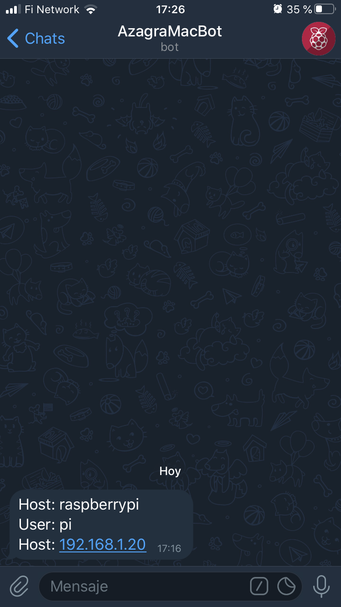

This simple script, which informs us of every ssh connection made to our Linux server, sends a notification to the Telegram bot we have created. 

No need to download additional libraries, it's all by curl. 

        

## Prerequisites

 - First create a bot in the Telegram [@BotFather](https://t.me/BotFather) account
 - Second, we need to know our ChatID, we will enter the telegram bot [@get_id_bot](https://t.me/get_id_bot)
 - We need to install if we don't have it, the curl command. `apt get install curl`
 
 ## Install
 - Add at the end of the file ***/etc/pam.d/sshd*** the following line
 `session    optional	pam_exec.so /path/to/script/notifyTelegram.sh`
 
 - We edit the script, adding our `token` and our `chat_id`
 
 - Assign execution permits.
 `chmod a+x /path/to/script/notifyTelegram.sh`

## Summary

The operation is simple, in each session start by SSH, will inform us of the user with which it has been accessed and its source IP. 

